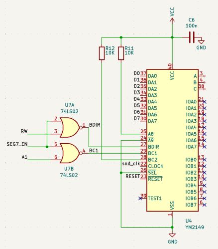

# Build
```shell
make rt68
```

# How to start the console
There are to options to to use EmuCON2

## Compile the ROM without AES and EmuCON2
In the makefile configure the following two lines:
rt68: WITH_AES = 0		# Either Graphic display, Ctrl+z to start console
rt68: WITH_CLI = 1		# or console

## Compile the ROM with AES
In the makefile configure the following two lines:
rt68: WITH_AES = 1		# Either Graphic display, Ctrl+z to start console
rt68: WITH_CLI = 0		# or console

Once the graphic UI has started, press `CTRL`+`Z`

## Mouse emulation with keyboard:
* ALT + arrow keys -> move mouse
* ALT + Insert -> left mouse button
* ALT + Home -> right mouse button

# Framebuffer memory layout:  
|Device|Start      |End        |Size |
|------|-----------|-----------|-----|
|RAM   |0x0000 0000|0x0007 FFFF|512KB|
|FB    |0x0037 0000|0x0037 7FFF| 32KB (to be updated, it's 64KB)|
|ROM   |0x0038 0000|0x003F FFFF|512KB|

# Useful infos
* https://github.com/emutos/emutos/compare/master...aslak3:emutos:master
* https://github.com/emutos/emutos/pull/29/files
* https://sourceforge.net/p/emutos/mailman/emutos-devel/thread/5100478E.2050207%40ist-schlau.de/#msg30391800
* [Intelligent Keyboard (ikbd) Protocol](https://www.kernel.org/doc/Documentation/input/atarikbd.txt)

#ROM boot address
The ROM image of EmutTOS contains in the first 4 bytes the SP and in the following 4 the PC.
That should be compatible with RT68 ROM boot mapping performed by the GLUE CPLD.


# Tested programs running under EmuCON2
* **unzip.ttp** works fine
* **stevie.tpp** works except for 
    * the arrow keys, probably because of the keyboard driver
    * you can use `h`, `l`, `j`, `k` as keys (only when not editing)
    * uses 40 columns instead of 80
* **XYZ.TTP** doesn't work, it could be because of the serial driver


# TODO
* implement keyboard driver (DONE)
* implement serial driver (DONE)
* implement mouse  driver (DONE)
* implement real time clock driver (DONE)

## Keyboard support
* The serial interrupt vector sends received characters to `call_ikbdraw`

## Sound support
The sound chip YM2149 (PSG) in the Atari ST and EmuTOS is used as following.

### Address decodig
In the Atari ST, the PSG is mapped from 0xffff8800
|Address   | Function|
|----------|---------|
|0xffff8800| when writing it is the ADDRESS, when reading it is DATA|
|0xffff8802| it is only used to write WRITE|

In the RT68 the mapping is:
|Address   | Function|
|----------|---------|
|0x0037e400| when writing it is the ADDRESS, when reading it is DATA|
|0x0037e402| it is only used to write WRITE|

I implemented a simple C application: `emutos-rt68k\ym2149`, that 
test the registers writing a reading a value and then plays a sound.

Also the following basic program can be used in EHBasic:

``` Basic
10 CTL = $37E400
20 DAT = $37E402
30 PRINT "1) READ CTL",HEX$(CTL) 
40 PRINT "2) WRITE 0 TO CTL",HEX$(CTL) 
50 PRINT "3) READ DAT",HEX$(DAT) 
60 PRINT "4) WRITE 0 TO DAT",HEX$(DAT) 
70 PRINT "5) EXIT"
80 INPUT OP
100 IF OP=1 THEN PRINT PEEK(CTL)
110 IF OP=2 THEN POKE CTL,0
120 IF OP=3 THEN PRINT PEEK(DAT)
130 IF OP=4 THEN POKE DAT,0
140 IF OP=5 THEN END
150 GOTO 30
```



### Interrupt
The PSG has no interrupt but EmuTOS has a function `sndirq` called when the Timer C triggers.
I have already implemented the Timer C that was used to refresh the screen before I implemented the VSYNC interrupt. 

### Enable PSG in EmuTOS
In order to enable PSG the preprocessor definition must be enable `CONF_WITH_YM2149`.

There is a bug, see *Keyboard Sound Bug* in the section below.


# Bugs

## Keyboard Sound Bug
When powering up RT68/EmuTOS, the keyboard beep plays as if a key is being 
pressed. It stops as soon as any key is pressed. After that, including after 
a reset, it works fine.

## Bus error bug
When opening a menu most of the time a Bus error is thrown.
The error is thrown by `fast_bit_blt` execution.
Possible reasons:
* a bug in the `video_shifter`, I could try to increase the time befor bus error 
  is thrown. It has to be done in the glue cpld.
* the blitter routines access inexistent memory address? How do I check this?
  The framebuffer is located from 0x350000 to 0x36FFFF

The problem may be an interrupt corrupting the registers.
Disabling the interrupts inside the do blitter seems to reduce the number
of bus errors but there still some.

## Fixed
The problem was the `duart_interrupt` interrupt routine, it only uses `a0` and 
I was saving in the stack only that one but it changes also other address registers,
perhaps the called `_vector_5ms` routine uses other registers?
Anyhow I saved all registers `d0-d7/a0-a6` in the stack and restore them when
it exists and there are no more bus errors.


### Log messages
For debugging purpose I disabled the fast blit (which doesn't log anything)
and enable the "slow" one, here it is the logged parameters and error:

The followings are the failing addresses and where in the code:
```
S_ADDR 4  0x003a 29f8
S_ADDR 4  0x0073 1e7c
```
```
S_ADDR 4  0x003a 2566
S_ADDR 4  0x0073 19ea
```
```
S_ADDR 2  0x0070 335a
```
```
S_ADDR 2  0x0070 0cf6
```


I logged accesses out of the RAM and FRAMEBUFFER intervals and the following
is the result:
```
Calling fast_bit_blt...Calling bit_blt...do_blit(): Start
X COUNT 13
Y COUNT 194
X S INC -2
Y S INC -2
X D INC -2
Y D INC -56
ENDMASK 0xffff-ffff-ffff
S_ADDR  0x00012f42
D_ADDR  0x00374264
HOP 2, OP 3
NFSR=1,FXSR=1,SKEW=0
S_ADDR  0x003a 21be
S_ADDR  0x0073 1642


Panic: Bus Error
misc=3015 opcode=3013
addr=00731642 sr=2004 pc=003942d2

D0-3: 00000000 00000000 2f0afffe 00002f0a
D4-7: ffff0000 0038f484 00370000 0001000c
A0-3: 0000ac3e 00393e8b 000042c0 00731642
A4-7: ffffffff 00373c22 fffffffe 0000ac34
 USP: 00000000

basepage=0001439e
text=003a4a90 data=00000000 bss=00000000
```

